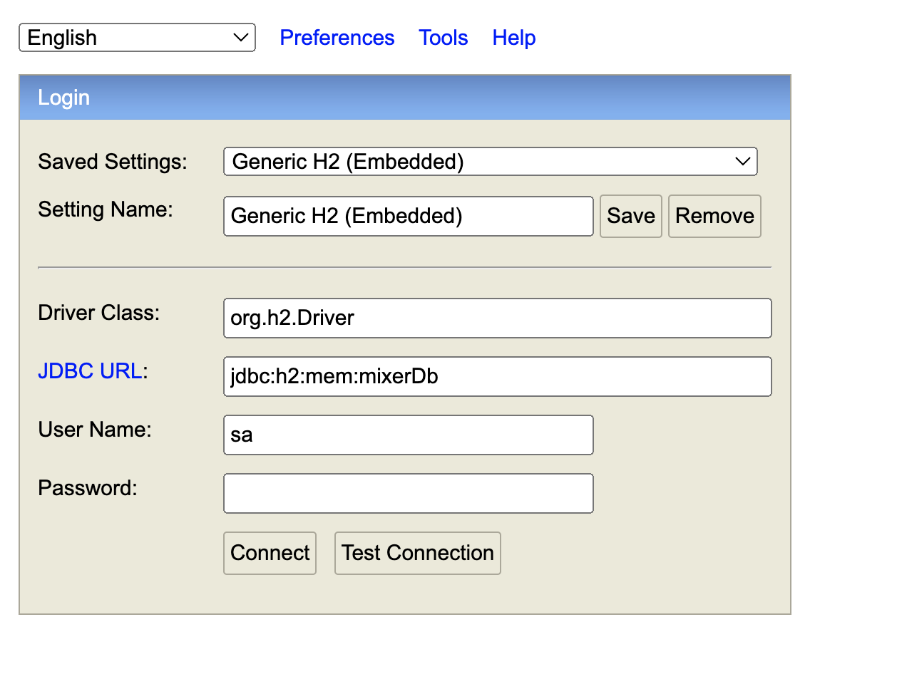
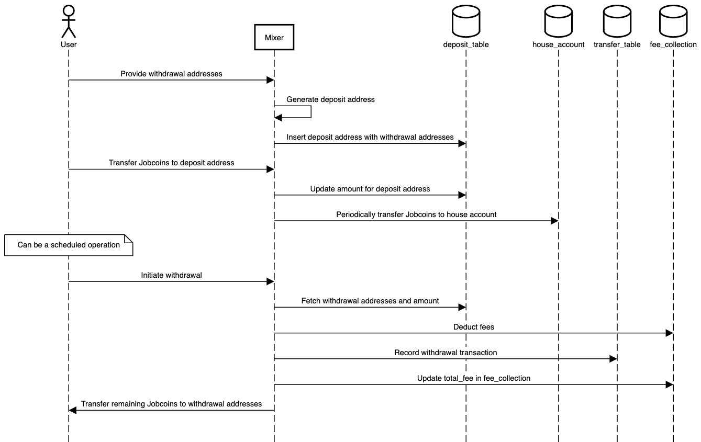
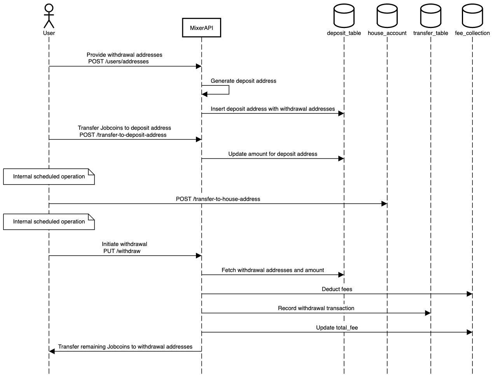
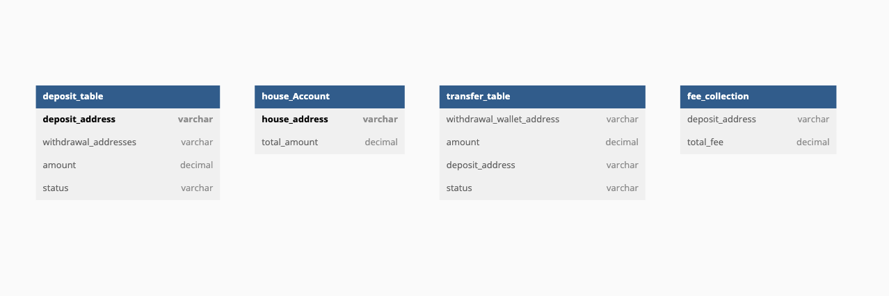

# Table of Contents

- [Local Installation](#local-installation)
- [User Journey](#user-journey)
- [Jobcoin mixer Transaction Flow Diagram](#jobcoin-mixer-transaction-flow-diagram)
- [Jobcoin mixer API Flow Diagram](#jobcoin-mixer-api-flow-diagram)
- [DB Model Diagram](#db-model-diagram)
- [Database Tables and Schemas](#database-tables-and-schemas)
- [Jobcoin-mixer API Documentation](#jobcoin-mixer-api-documentation)
   - [Create User Addresses](#create-user-addresses)
   - [Transfer to Deposit Address](#transfer-to-deposit-address)
   - [Transfer to House Address](#transfer-to-house-address)
   - [Withdraw Jobcoins to withdrawal addresses](#withdraw-jobcoins-to-withdrawal-addresses)


# Local Installation
* Clone code from the created git repository to your local machine.

* Use your favourite IDE and import the cloned repository as a Maven project. You will need to:

  * have Java 11+ installed
  * enable Maven support in your IDE;
  * install Apache Maven if not already installed.
* One way is to execute the main method in the ```com.jobcoinmixer.app.JobcoinMixerApplication.java``` class from your IDE.
* Alternatively you can use the Spring Boot Maven plugin like so:

```mvn spring-boot:run```

# How to access H2 in-memory Database
* Go to http://localhost:8080/h2-console/ and enter the following:
  * JDBC URL: jdbc:h2:mem:mixerDb
  * User Name: sa
  * Password:
    * Note: Leave the password field blank.


* Once you are logged in, you can run standard MySQL queries to view the data in the database.
    


# User Journey

1. The user provides a list of withdrawal addresses.
2. The mixer generates and returns a deposit address for the user.
3. The user transfers Jobcoins from their wallet to the generated deposit address.
    - *Note: In an ideal scenario, this transfer would be performed through the Jobcoin network application, which is a separate application. However, for demo purposes, I have implemented this functionality within the mixer application itself by exposing an API.*
4. The mixer periodically transfers the deposited Jobcoins to the house account of the mixer.
    - *Note: Ideally, this transfer operation would be scheduled, but for the demo, I have created an API that handles this behavior.*
5. After a certain delay, the mixer deducts fees and transfers the remaining Jobcoins to the specified withdrawal addresses.
    - *Note: This step should also be scheduled, but for now, I have exposed an API to facilitate this behavior.*

# Jobcoin mixer Transaction Flow Diagram


# Jobcoin mixer API Flow Diagram


# DB Model Diagram


# Database Tables and Schemas

1. **deposit_table**:

   **Columns**:

   - `deposit_address` (String, primary key): The generated deposit address for each user.
   - `withdrawal_addresses` (Array of Strings): The list of withdrawal addresses provided by the user.
   - `amount` (Decimal, default 0): The total amount of Jobcoins deposited.
   - `status` (String): Current status of deposit (possible values:  "CREATED," "TRANSFERRED," "MOVED_TO_HOUSE").)

2. **house_Account**:

   **Columns**:

   - `houseAddress` (String, primary key): The address of the house account.
   - `totalAmount` (Decimal): The total amount of Jobcoins in the house account.

3. **transfer_table**:

   **Columns**:

   - `withdrawal_wallet_address` (String): The withdrawal address for the transfer.
   - `amount` (Decimal): The amount of Jobcoins to be transferred.
   - `deposit_address`: Deposit address for this withdrawal address
   - `status` (String): The status of the transfer (possible values: "IN_PROGRESS," "COMPLETED," "FAILED").

4. **fee_collection**:

   **Columns**:

   - `deposit_address` (String): The deposit address associated with the fee.
   - `total_fee` (Decimal): The total fee collected.


# Jobcoin-mixer API Documentation

## Create User Addresses

**Endpoint**: `POST /users/addresses`

**Request:**

- Method: `POST`
- Headers:
   - `Content-Type: application/json`
- Body:
  ```json
  {
      "withdrawal_addresses": [
          "add-1",
          "add-2"
      ]
  }
- Example Request:
   ```bash
   curl --location --request POST 'http://localhost:8080/users/addresses' \
   --header 'Content-Type: application/json' \
   --data-raw '{
       "withdrawal_addresses": [
           "add-1",
           "add-2"
       ]
   }'
- Response:
   ```bash
  {
      "depositAddress": "b3641a70-cd95-4b4b-8452-d411f571da8f"
  }

## Transfer to Deposit Address
**Endpoint**: POST /transfer-to-deposit-address

**Request:**

- Method: `POST`
- Headers:
   - `Content-Type: application/json`
- Body:
  ```json
  {
    "from": "wallet_address",
    "to": "b3641a70-cd95-4b4b-8452-d411f571da8f",
    "amount": "200.0"
   }
- Example Request:
   ```bash
   curl --location --request POST 'http://localhost:8080/transfer-to-deposit-address' \
   --header 'Content-Type: application/json' \
   --data-raw '{
   "from": "wallet_address",
   "to": "b3641a70-cd95-4b4b-8452-d411f571da8f",
   "amount": "200.0"
   }'
- Response:
   ```bash
  {
    "status": "success"
   }


## Transfer to House Address
**Endpoint**: POST /transfer-to-house-address

**Request:**

- Method: `POST`
- Headers:
   - `None`
- Example Request:
   ```bash
   curl --location --request POST 'http://localhost:8080/transfer-to-house-address'
- Response:
   ```bash
  {
    "status": "success"
   }

## Withdraw Jobcoins to withdrawal addresses
**Endpoint**: PUT /withdraw

**Request:**

- Method: `PUT`
- Headers:
   - `Content-Type: application/json`
- Body:
  ```json
  {
    "deposit_address": "b3641a70-cd95-4b4b-8452-d411f571da8f"
   }
- Example Request:
   ```bash
   curl --location --request PUT 'http://localhost:8080/withdraw' \
   --header 'Content-Type: application/json' \
   --data-raw '{
   "deposit_address": "b3641a70-cd95-4b4b-8452-d411f571da8f"
   }'
- Response:
   ```bash
  []
